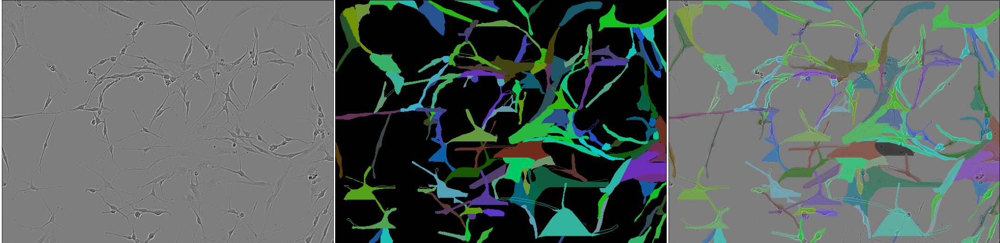
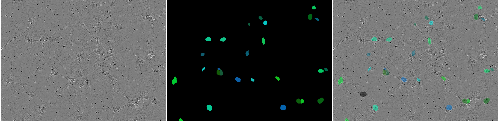

# Cell Instance Segmentation


## Description

Cell segmentation in microscopic images is crucial for diagnosing various diseases and remains one of the most time-consuming and expensive stages of examination. In this project, we have used different model architectures that perform automatic image segmentation, compare their performances on Sartorious benchmark dataset, and analyze their efficiency on different cell types. Our solution is based on Mask R-CNN and Cellpose models, which we trained with various augmentations, fine-tuned and optimized postprocessing hyperparameters. Both models are inferenced and available in a form of jupyter notebooks [inference_cellpose](./inference_cellpose.ipynb), [inference_mask_rcnn](./inference_mask_rcnn.ipynb).

## Contributors

**Authors:** [Shamil Arslanov](https://github.com/homomorfism), [Maxim Faleev](https://github.com/implausibleDeniability), [Danis Alukaev](https://github.com/DanisAlukaev)
**Group:** B19-DS-01, Innopolis University

## How to run it locally?
1. Download and unzip [data](https://drive.google.com/file/d/1rTzbFDhNqSuow1G_tbuT4FARP2VbJrhJ/view?usp=sharing) and [weights](https://drive.google.com/file/d/1AMx5DWB22sxcRabIDv8GwdNMRE6O_Tmv/view?usp=sharing) in the working directory (dirs `data` and `weights` should appear there along with `src`, `demo`, etc.)
2. Install dependencies in your python environment (make sure that python is of **version 3.9**) <br>
```
pip install -r requirements.txt
```
3. Rename `.env.example` file to `.env` and specify paths for dataset and weights directories (see step 1)
4. Run training routine with following command
```
PYTHONPATH=. python src/train_val_mask_rcnn.py --device cuda:0 --exp_name init-training
```
5. Run inference of [cellpose](./inference_cellpose.ipynb) and [mask r-cnn](./inference_mask_rcnn.ipynb) in jupyter notebook.

## Contents

- **Mask R-CNN**  
  The initial model we've used was Mask R-CNN. The model was trained with **pytorch**. Here
  is [path to training script](src/train_val_mask_rcnn.py).
- **Hyperparameters optimization**  
  Hyperparameters were optimized with **optuna**.
  Optimization scripts, config template and instructions are in `finetuning_parameters/`
- **Postprocessing optimization**  
  Postprocessing of the NN output includes non-maximal suppression, removal of overlapping pixels,
  and other transformations. Parameters for these transformations can be optimized through
  `src/thresholds_optimization.py`.
- **Exploratory Data Analysis**  
  All EDA performed during the competition is available in `jupyter-notebooks/`

## Data visualisation




*Types of cells from top to bottom: shsy5y, astro, cort*

## Troubleshooting

- `ModuleNotFoundError...` - add root folder of repository by running `export PYTHONPATH=$PYTHONPATH:/path/to/repo`

