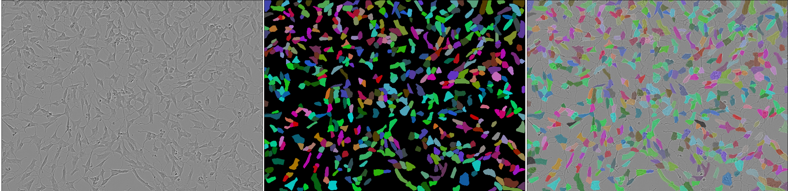

# Kaggle Competition: Sartorius Cell Instance Segmentation

## Description

In this project we implemented different algorithms for cell segmentation in microscopic images. Firstly, we trained
Mask
R-CNN and Cellpose models, then we tuned model and postprocessing hyperparameters of Mask R-CNN model, and finally we
prepared notebook with visualisation of model predictions. In `figures` directory you can find:

- examples of broken masks (please refer to report)
- visualisation of cellpose model predicted masks
- visualisation of Mask R-CNN model predicted masks
- visualisation of test masks

## Authors

[Shamil Arslanov](https://github.com/homomorfism), [Maxim Faleev](https://github.com/implausibleDeniability)
and [Danis Alukaev](https://github.com/DanisAlukaev), 4'th year students of Innopolis University.

## Contents

- **Mask R-CNN**  
  The initial model we've used was Mask R-CNN. The model was trained with **pytorch**. Here
  is [path to training script](src/train_val_mask_rcnn.py).
- **Hyperparameters optimization**  
  Hyperparameters were optimized with **optuna**.
  Optimization scripts, config template and instructions are in `finetuning_parameters/`
- **Postprocessing optimization**  
  Postprocessing of the NN output includes non-maximal suppression, removal of overlapping pixels,
  and other transformations. Parameters for these transformations can be optimized through
  `src/thresholds_optimization.py`.
- **Exploratory Data Analysis**  
  All EDA performed during the competition is available in `jupyter-notebooks/`

## How to download data

- `cd data/`
- `kaggle competitions download -c sartorius-cell-instance-segmentation`
- `unzip sartorius-cell-instance-segmentation.zip`

## Data visualisation




*Types of cells from top to bottom: shsy5y, astro, cort*

## How to run training script

1. Download data (see instructions below)
2. Rename `.env.example` file to `.env` and specify paths for dataset and weights storage
3. Run `pip install -r requirements.txt` for installing needed packages
4. Run training by command

```
PYTHONPATH=. python src/train_val_mask_rcnn.py --device cuda:0 --exp_name init-training
```

## Troubleshooting

- `ModuleNotFoundError...` - add root folder of repository by running `export PYTHONPATH=$PYTHONPATH:/path/to/repo`

